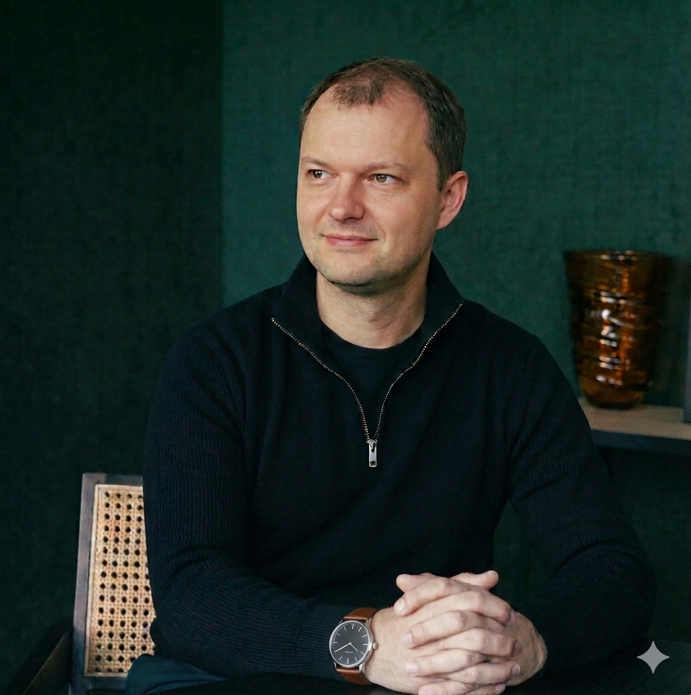
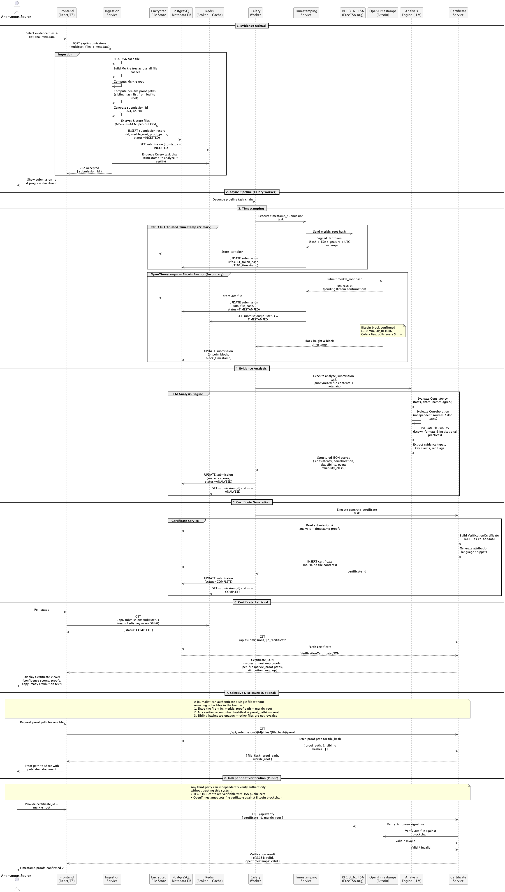

## About the Author



### Jônatas Kirsch

- Senior full-stack engineer with 20+ years of experience.
- Solo-architected an AI-powered merchant intelligence platform from zero to production;
- Helped build the digital bank of the third-largest bank in Latin America.
- Former fintech founder.
- Strong track record of owning systems end-to-end (architecture → deployment → scale), shipping 0→1 products under regulatory constraints, and leading distributed engineering teams.

<br clear="left" />

---

# ASVS — Anonymous Source Verification System

A prototype system that receives evidence from anonymous sources, proves it existed at a specific point in time before any analysis occurs, and generates a privacy-preserving certificate with publication-ready attribution language for journalists.

The core problem: anyone can hash a file *after* creating it. ASVS solves this by anchoring a cryptographic fingerprint of the evidence to two independent, externally-verifiable timestamp authorities at the moment of ingestion — before any human reviews the content.

> **Important:** This system proves provenance — integrity, chronology, and non-tampering. It cannot prove that the content of the evidence is truthful. The confidence score is a structured editorial aid, not a verdict. See [docs/ARCHITECTURE.md](docs/ARCHITECTURE.md#2-what-this-system-can-and-cannot-prove).

---

## Documentation

| Document | Description |
|---|---|
| [docs/BUSINESS_REQUIREMENTS.md](docs/BUSINESS_REQUIREMENTS.md) | Objectives, sample scenario, and certificate output format |
| [docs/ARCHITECTURE.md](docs/ARCHITECTURE.md) | System design, component breakdown, security model, and scope decisions |
| [docs/ANALYSIS_METHODOLOGY.md](docs/ANALYSIS_METHODOLOGY.md) | How the LLM analysis works, scoring dimensions, weights, and output fields |
| [docs/sequence-diagram.puml](docs/sequence-diagram.puml) | Full end-to-end PlantUML sequence diagram |

### Submission Flow



---

## Technology Stack

| Layer | Technology |
|---|---|
| Frontend | React 18 + TypeScript (Vite) |
| API | FastAPI (Python 3.12) |
| Async pipeline | Celery + Redis |
| Database | PostgreSQL 17 |
| Schema migrations | Liquibase (YAML changelogs) |
| Timestamp (primary) | RFC 3161 via `rfc3161ng` — FreeTSA.org (EC P-384, valid to 2040) |
| Timestamp (secondary) | OpenTimestamps — Bitcoin `OP_RETURN` |
| Integrity | SHA-256 per file + Merkle tree with per-file proof paths |
| Encryption at rest | AES-256-GCM |
| LLM analysis | OpenAI GPT-4o (configurable; swap for local Ollama) |
| PDF generation | `reportlab` / `weasyprint` |
| Styling | Tailwind CSS |

---

## Prerequisites

- **Docker Desktop** 4.x or later (PostgreSQL and Redis run as containers)
- **Python 3.12+** with `pip`
- **Node.js 22+** with `npm`
- An **OpenAI API key** (or a local [Ollama](https://ollama.com) instance)

---

## Getting Started

### 1. Clone and configure environment

```bash
git clone https://github.com/jonatasjk/anonymous-source-verification-system.git
cd anonymous-source-verification-system

cp backend/.env.example backend/.env
# Edit backend/.env — set POSTGRES_PASSWORD, SECRET_KEY, and OPENAI_API_KEY
```

Generate a secure `SECRET_KEY`:

```bash
python -c "import secrets; print(secrets.token_hex(32))"
```

### 2. Start infrastructure

```bash
docker compose -f backend/docker-compose.yml up -d
```

### 3. Run database migrations

```bash
docker compose -f backend/docker-compose.yml --profile migrate up liquibase
```

### 4. Install and start the backend

```bash
cd backend
python -m venv .venv && source .venv/bin/activate
pip install -r requirements.txt

uvicorn app.main:app --reload
# API available at http://localhost:8000
```

### 5. Start the Celery worker

```bash
# In a separate terminal, with .venv active
celery -A app.tasks.celery_app worker --loglevel=info
```

### 6. Install and start the frontend

```bash
cd frontend
npm install
npm run dev
# UI available at http://localhost:5173
```

---

## Project Structure

```
anonymous-source-verification-system/
├── backend/
│   ├── app/                  # FastAPI application
│   │   ├── routers/          # API endpoints
│   │   ├── services/         # Ingestion, timestamping, analysis, certificate
│   │   ├── tasks/            # Celery pipeline tasks
│   │   ├── models/           # SQLAlchemy models + Pydantic schemas
│   │   └── core/             # Config, crypto helpers, Merkle tree
│   ├── db/changelog/         # Liquibase YAML migration changelogs
│   ├── sample_evidence/      # Test fixtures for the academic misconduct scenario
│   ├── .env.example
│   ├── docker-compose.yml
│   └── requirements.txt
├── frontend/
│   └── src/
│       ├── components/       # UploadWizard, StatusDashboard, CertificateViewer
│       ├── hooks/
│       └── types/
└── docs/
    ├── BUSINESS_REQUIREMENTS.md
    ├── ARCHITECTURE.md
    ├── sequence-diagram.puml
    └── sequence-diagram.png
```

